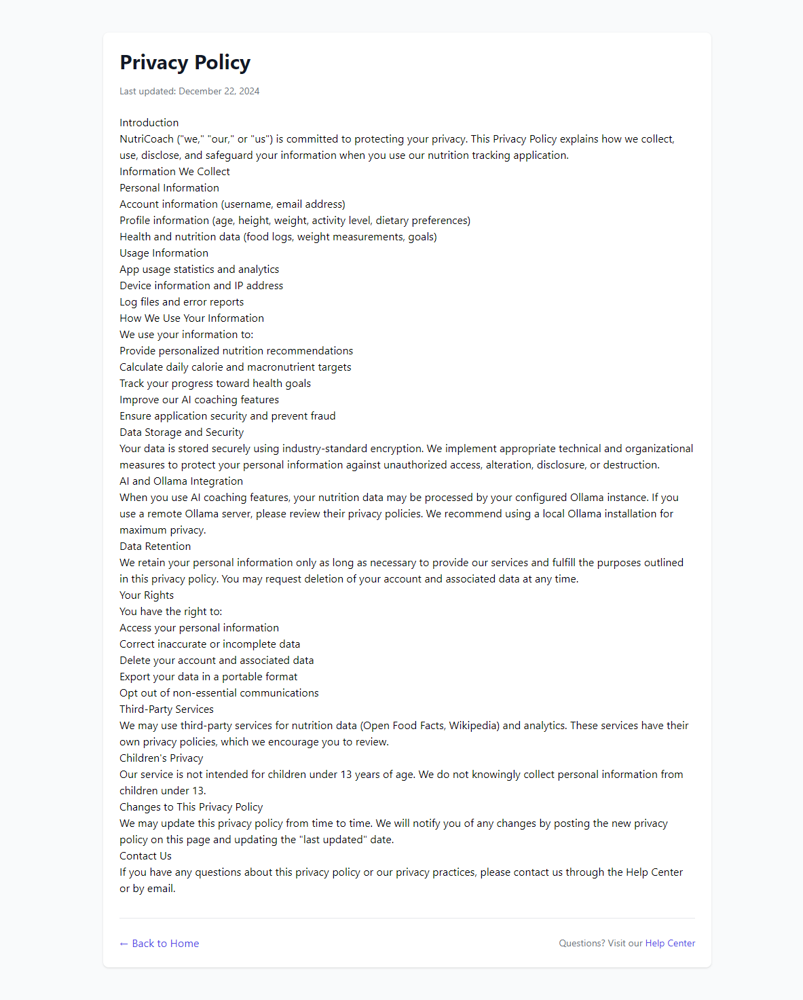

# NutriCoach Onboarding Process Documentation

**Complete Visual Guide with Screenshots**

*Generated: August 22, 2025 at 07:11 AM*

---

## Overview

This document provides a comprehensive visual guide to the NutriCoach onboarding and registration process. All screenshots were captured using automated browser testing to ensure accuracy.

### Process Flow:
1. **Homepage** - Introduction and call-to-action
2. **Registration** - New user account creation  
3. **Login** - Existing user authentication
4. **Legal Pages** - Privacy, terms, help, and disclaimers

### Key Features:
- Responsive web design for all devices
- Professional UI with dark mode support
- Comprehensive legal documentation
- User-friendly navigation and forms

---

## Step 1: Homepage

Landing page with Get Started button

**URL:** `http://localhost:5001`

---

## Step 2: Registration Page

User registration form

**URL:** `http://localhost:5001/auth/register`

---

## Step 3: Login Page

Existing user login form

**URL:** `http://localhost:5001/auth/login`

---

## Step 4: Privacy Policy

Privacy policy and data handling

**URL:** `http://localhost:5001/privacy`

---

## Step 5: Terms of Service

Terms of service and usage guidelines

**URL:** `http://localhost:5001/terms`

---

## Step 6: Help Center

Help center and FAQ

**URL:** `http://localhost:5001/help`

---

## Step 7: Medical Disclaimer

Medical disclaimer and health warnings

**URL:** `http://localhost:5001/disclaimer`

---

## Onboarding Steps (Post-Registration)

After successful registration, users go through a 4-step onboarding process:

### Step 1: Basic Information
- **Purpose:** Collect personal details for BMR/TDEE calculations
- **Fields:** Name, Age, Sex, Height, Weight
- **Required:** All fields mandatory for accurate nutrition targets

### Step 2: Fitness Goals  
- **Purpose:** Define objectives and activity level
- **Fields:** Activity level, goal type (lose/maintain/gain), target weight, timeframe
- **Smart Features:** Dynamic form based on goal selection

### Step 3: Lifestyle & Preferences
- **Purpose:** Personalize meal recommendations
- **Fields:** Dietary preferences, allergies, budget, cooking skills, equipment
- **Customization:** Multiple selection options for comprehensive profiling

### Step 4: AI Configuration
- **Purpose:** Set up Ollama for AI coaching features
- **Fields:** Ollama URL, model selection
- **Options:** Local or remote AI server configuration

### Dashboard Welcome
- **Result:** Personalized nutrition dashboard
- **Features:** Daily targets, progress tracking, AI coaching
- **Ready:** Complete nutrition tracking system

---

## Technical Implementation

### Security Features:
- CSRF protection on all forms
- Password strength requirements  
- Email validation and uniqueness checks
- Session management for authenticated users

### Accessibility:
- Form validation with clear error messages
- Progress indicators during multi-step processes
- Responsive design for mobile and desktop
- Professional typography and color schemes

### Privacy & Legal:
- Comprehensive privacy policy explaining data usage
- Clear terms of service with health disclaimers  
- Medical disclaimer emphasizing professional consultation
- Interactive help center with searchable FAQ

---

## Files Generated

This documentation includes the following screenshot files:

- `screenshots/onboarding/onboarding_01_homepage.png` - Landing page with Get Started button
- `screenshots/onboarding/onboarding_02_registration.png` - User registration form
- `screenshots/onboarding/onboarding_03_login.png` - Existing user login form
- `screenshots/onboarding/onboarding_04_privacy.png` - Privacy policy and data handling
- `screenshots/onboarding/onboarding_05_terms.png` - Terms of service and usage guidelines
- `screenshots/onboarding/onboarding_06_help.png` - Help center and FAQ
- `screenshots/onboarding/onboarding_07_disclaimer.png` - Medical disclaimer and health warnings

All screenshots captured at 1200x800 resolution for optimal clarity and organized in proper folder structure.

---

*Documentation generated using Playwright browser automation*
