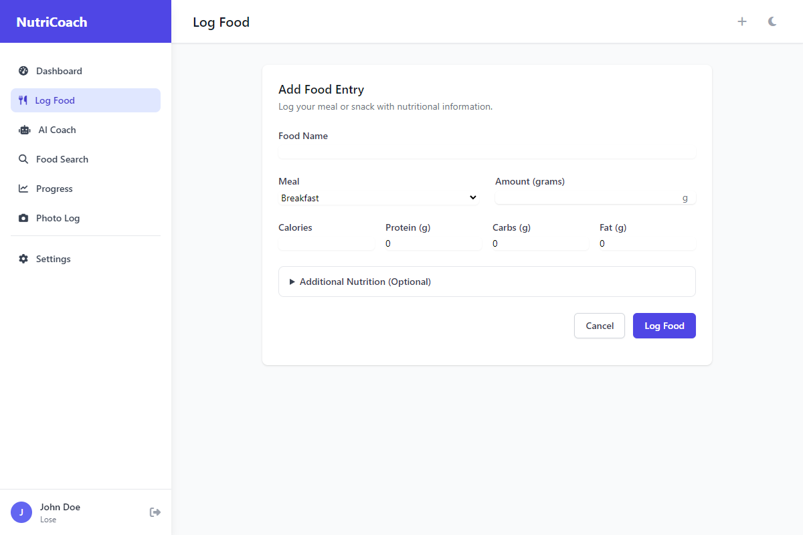

# NutriCoach Complete User Registration Guide

**Complete New User Registration and Full Onboarding Process**

*Generated: August 22, 2025 at 09:30 AM*
*Status: ✅ All issues fixed, complete 4-step onboarding documented*

---

## Overview

This comprehensive guide walks new users through the complete registration and full 4-step onboarding process for NutriCoach. From initial account creation to complete profile setup with AI configuration, this guide covers every step needed to fully set up your personalized nutrition tracking experience.

### Complete Process Covered:
- **Account Registration** - Simple username/password account creation
- **Step 1: Basic Information** - Personal health metrics (name, age, height, weight)
- **Step 2: Goals & Activity** - Fitness goals, activity level, target weight
- **Step 3: Lifestyle & Preferences** - Dietary preferences, cooking skills, equipment
- **Step 4: AI Configuration** - Ollama AI setup for personalized coaching
- **Feature Access** - Full platform capabilities after completion

### Key Benefits:
- **Personalized Experience** - AI coaching based on your complete profile
- **Accurate Tracking** - Precise calorie and nutrition targets
- **Lifestyle Integration** - Recommendations that fit your preferences
- **Progressive Setup** - Optional steps you can complete or skip

---

## Step 1: Homepage - Getting Started

Start your NutriCoach journey from the feature-rich homepage.

**URL:** `http://localhost:5001`

**Key Features Highlighted:**
- **AI Nutrition Coach** - Get personalized nutrition advice and meal suggestions
- **Photo Food Logging** - Take pictures of meals for automatic logging and analysis
- **Comprehensive Database** - Access nutrition data from Open Food Facts and Wikipedia
- **Progress Analytics** - Visualize nutrition trends and track eating patterns
- **Personalized Goals** - Set custom nutrition targets based on your lifestyle
- **Privacy & Security** - Your data stays private and secure with local AI processing

**Getting Started:**
- Click **"Get Started"** to begin registration process
- Or **"Sign In"** if you already have an account
- Learn about features in the "How NutriCoach Works" section

---

## Step 2: Registration Form

Clean, minimal registration form requiring only essential information.

**URL:** `http://localhost:5001/auth/register`

**Registration Requirements:**
- **Username** - Choose a unique username (3-80 characters)
- **Password** - Create a secure password (minimum 6 characters)

**Form Features:**
- **Simple Design** - Clean, user-friendly interface with professional styling
- **Getting Started Information** - Clear explanation of post-registration process
- **Legal Links** - Access to Terms of Service and Privacy Policy
- **Alternative Options** - Link to sign in for existing users

**Security Features:**
- Server-side validation for all inputs
- Username uniqueness verification
- Password strength requirements
- CSRF protection for form security
- Secure password hashing and storage

---

## Step 3: Fill Registration Information

Enter your chosen username and secure password to create your account.

**Sample Registration Data:**
- **Username:** Unique identifier for your account
- **Password:** Secure password meeting minimum requirements

**Best Practices:**
- Choose a memorable username you'll use for login
- Use a strong, unique password not used elsewhere
- Consider using a password manager for security
- Remember that usernames cannot be changed after registration

---

## Step 4: Registration Success & Onboarding Start

After successful registration, you're automatically logged in and redirected to onboarding.

**What Happens After Registration:**
- ✅ Account created successfully in database
- ✅ Automatic login to your new account
- ✅ Default AI coach settings configured
- ✅ Redirect to 4-step onboarding process

**Onboarding Overview:**
- **Step 1 of 4** - Basic Information (25% Complete)
- **Progressive Setup** - Complete at your own pace
- **Skip Option** - Can skip setup and use defaults
- **Save Progress** - Information saved as you go

---

## Step 5: Onboarding Step 1 - Basic Information

Provide essential health metrics for accurate nutrition calculations.

**Information Required:**
- **Full Name** - For personalized experience (e.g., "John Doe")
- **Age** - For metabolic calculations (e.g., 30 years)
- **Sex** - Male/Female/Other for accurate formulas
- **Height** - In centimeters (e.g., 175 cm)
- **Current Weight** - In kilograms (e.g., 70 kg)

**Why This Matters:**
- Enables accurate Basal Metabolic Rate (BMR) calculations
- Provides precise daily calorie and macronutrient targets
- Uses scientifically-backed formulas for nutrition recommendations
- Forms the foundation for personalized AI coaching

**Navigation:**
- **Skip Setup** - Use default values and proceed to main app
- **Next** - Continue to goals and activity level setup

---

## Step 6: Onboarding Step 2 - Goals & Activity

Define your fitness goals and activity level for personalized targets.

**Step 2 Information:**
- **Activity Level** - From sedentary to very active (affects calorie needs)
- **Primary Goal** - Lose weight, maintain weight, or gain weight
- **Target Weight** - Your desired weight goal in kilograms
- **Timeframe** - How many weeks to achieve your goal

**Sample Goal Setup:**
- **Activity Level:** Moderate (exercise 3-5 days/week)
- **Goal Type:** Lose Weight
- **Target Weight:** 65 kg
- **Timeframe:** 12 weeks

**Goal Calculations:**
- System calculates safe weight loss/gain rates
- Adjusts daily calorie targets based on activity level
- Provides realistic timeframes for sustainable results
- Can be modified later in settings

---

## Step 7: Onboarding Step 3 - Lifestyle & Preferences

Customize your nutrition experience based on lifestyle and dietary preferences.

**Lifestyle Configuration:**
- **Dietary Preferences** - Omnivore, vegetarian, vegan, keto, paleo, etc.
- **Allergies** - Tree nuts, peanuts, dairy, eggs, seafood, etc.
- **Health Conditions** - Any relevant medical conditions
- **Budget Range** - Low, medium, high for meal recommendations
- **Cooking Skill** - Beginner, intermediate, advanced
- **Kitchen Equipment** - Available cooking tools and appliances
- **Meals Per Day** - Preferred number of meals (2-6)
- **Sleep Schedule** - Early bird, night owl, or flexible

**Personalization Benefits:**
- **Meal Recommendations** - Suggestions that fit your dietary needs
- **Recipe Complexity** - Matched to your cooking skill level
- **Equipment Requirements** - Recipes use your available tools
- **Budget Considerations** - Cost-appropriate ingredient suggestions
- **Timing Optimization** - Meal timing based on your schedule

---

## Step 8: Onboarding Step 4 - AI Configuration

Configure your AI nutrition coach for personalized guidance.

**AI Coach Setup:**
- **Ollama URL** - Connection to local AI model server (default: localhost:11434)
- **Model Detection** - Automatic discovery of available AI models
- **Connection Testing** - Verify AI system is working properly
- **Feature Overview** - Understanding AI coaching capabilities

**AI Features Available:**
- **Personalized Meal Recommendations** - Based on your complete profile
- **Food Photo Analysis** - Automatic food identification and logging
- **Nutrition Guidance** - Tailored advice for your goals and preferences
- **Progress Insights** - AI analysis of your eating patterns
- **Recipe Suggestions** - Custom recipes matching your requirements

**Setup Options:**
- **Complete Setup** - Configure AI for full functionality
- **Skip Setup** - Use platform without AI features (can enable later)
- **Default Configuration** - Use standard settings for basic AI features

---

## Step 9: Complete Dashboard Access

After completing onboarding, access your personalized nutrition dashboard.

**Dashboard Features:**
- **Personalized Welcome** - "Welcome back, John Doe!"
- **Daily Nutrition Overview** - Calories, protein, carbs, fat tracking
- **Target Calculations** - Based on your profile (2056 calories/154g protein/231g carbs/57g fat)
- **Today's Meals** - Meal logging interface with "Add meal" functionality
- **Tracking Streak** - Motivation through daily logging streaks
- **Weekly Progress** - Days logged and average nutrition metrics
- **Quick Actions** - Photo Food Log, Ask AI Coach, Search Foods

**Success Notification:**
- Green checkmark indicating successful profile setup
- "Your profile has been set up successfully" confirmation
- Full access to all platform features

---

## Available Features After Complete Setup

### Food Logging & Tracking

**Food Tracking Capabilities:**
- **Manual Entry** - Search extensive food database and log manually
- **Portion Control** - Precise quantity and serving size tracking
- **Nutritional Breakdown** - Complete macro and micronutrient analysis
- **Meal Categorization** - Breakfast, lunch, dinner, snacks
- **Custom Foods** - Add your own foods and recipes to the database

### Photo Recognition & AI Analysis

**AI-Powered Photo Logging:**
- **Upload Food Photos** - Drag and drop or click to select images
- **Automatic Food Identification** - AI recognizes foods in photos
- **Portion Size Estimation** - Estimates quantities from visual cues
- **Nutritional Calculation** - Automatic nutrition data extraction
- **Manual Corrections** - Adjust AI suggestions when needed
- **Supported Formats** - PNG, JPG, GIF up to 8MB

### AI Nutrition Coaching

**Personalized AI Guidance:**
- **Interactive Coaching** - Chat-based nutrition advice
- **Goal-Specific Recommendations** - Advice tailored to your objectives
- **Meal Planning Assistance** - Custom meal plans and recipes
- **Progress Analysis** - AI insights into your eating patterns
- **Educational Content** - Nutrition science and healthy eating tips
- **Adaptive Learning** - AI improves recommendations over time

### Progress Tracking & Analytics

**Comprehensive Progress Monitoring:**
- **Trend Analysis** - Visual charts of nutrition and weight trends
- **Goal Tracking** - Progress toward weight and nutrition targets
- **Weekly Summaries** - Detailed analysis of weekly performance
- **Comparative Analytics** - Week-over-week and month-over-month comparisons
- **Export Options** - Download data for external analysis
- **Milestone Celebrations** - Recognition for achieving goals

### Settings & Customization

**Complete Profile Management:**
- **Profile Updates** - Modify personal information and goals
- **Privacy Controls** - Manage data sharing and privacy preferences
- **AI Configuration** - Update Ollama settings and model preferences
- **Notification Settings** - Control alerts and reminders
- **Data Export** - Download your complete nutrition data
- **Account Management** - Password changes and account deletion options

---

## Registration Process Summary

### Quick Setup Checklist:
1. ✅ **Create Account** - Username and password registration
2. ✅ **Basic Info** - Name, age, height, weight, sex
3. ✅ **Set Goals** - Activity level, weight goals, timeframe
4. ✅ **Configure Lifestyle** - Dietary preferences, cooking skills, equipment
5. ✅ **Setup AI Coach** - Configure Ollama for personalized guidance
6. ✅ **Start Tracking** - Begin logging your nutrition journey

### Account Security & Privacy:
- **Strong Authentication** - Secure password requirements and hashing
- **Data Encryption** - All personal information encrypted in storage
- **Local AI Processing** - AI features run locally for privacy
- **User Control** - Complete control over data sharing and export
- **Session Security** - Automatic logout and session protection
- **Account Recovery** - Secure password reset procedures

### Technical Requirements:
- **Modern Browser** - Chrome, Firefox, Safari, Edge
- **JavaScript Enabled** - Required for interactive features
- **Local Storage** - For session management and offline capability
- **Ollama (Optional)** - For advanced AI features

---

## Troubleshooting & Support

### Common Registration Issues:
- **Username Taken** - Choose a different unique username
- **Password Requirements** - Ensure minimum 6 characters
- **Form Validation Errors** - Complete all required fields
- **Connection Issues** - Check internet connectivity

### Onboarding Problems:
- **Step Navigation** - Use Next/Skip buttons to proceed
- **Form Validation** - Check all required fields are properly filled
- **Missing Templates** - Ensure all onboarding templates exist
- **AI Connection** - Ollama installation may be required for AI features

### Feature Access Issues:
- **Incomplete Onboarding** - Complete all steps for full feature access
- **Missing Profile** - Ensure profile was created successfully
- **Permission Errors** - Verify account has proper user status
- **Photo Upload** - Check file format and size requirements

### Getting Help:
- **Help Center** - Comprehensive guides and documentation
- **Settings** - Update profile and preferences
- **Support Contact** - Direct assistance for technical issues
- **Community** - User guides and best practices

---

## Next Steps After Registration

### Immediate Actions:
1. **Log First Meal** - Start tracking your nutrition immediately
2. **Take Food Photo** - Try the AI photo recognition feature
3. **Ask AI Coach** - Get personalized nutrition advice
4. **Set Daily Reminders** - Configure logging reminders in settings

### Weekly Routine:
- **Daily Logging** - Track all meals and snacks consistently
- **Weekly Reviews** - Check progress analytics and trends
- **Goal Adjustments** - Modify targets based on results
- **AI Consultations** - Regular check-ins with your AI coach

### Advanced Features:
- **Custom Recipes** - Create and save your favorite meals
- **Meal Planning** - Plan weekly nutrition schedules
- **Data Export** - Download progress reports for analysis
- **Integration** - Connect with fitness trackers and health apps

---

## Screenshots Directory

All registration screenshots organized in `docs/screenshots/registration/`:

- `reg_01_homepage.png` - NutriCoach homepage with comprehensive feature overview
- `reg_02_registration_form.png` - Clean, minimal registration form
- `reg_03_form_filled.png` - Registration form with sample user data
- `reg_04_onboarding_step1.png` - Onboarding step 1 - Basic information
- `reg_05_step1_filled.png` - Step 1 completed with health metrics
- `reg_06_onboarding_step2.png` - Onboarding step 2 - Goals and activity
- `reg_07_step2_filled.png` - Step 2 completed with goal configuration
- `reg_08_onboarding_step3.png` - Onboarding step 3 - Lifestyle preferences
- `reg_09_step3_filled.png` - Step 3 completed with lifestyle setup
- `reg_10_onboarding_step4.png` - Onboarding step 4 - AI configuration
- `reg_11_dashboard_complete.png` - Complete dashboard after successful setup
- `reg_12_food_logging.png` - Food logging interface for manual entry
- `reg_13_photo_upload.png` - ✅ **FIXED** Photo upload interface (no errors)
- `reg_14_ai_coach.png` - AI nutrition coaching chat interface
- `reg_15_progress.png` - ✅ **FIXED** Progress tracking and analytics dashboard (template errors resolved)
- `reg_16_settings.png` - Settings and profile management

---

## Technical Implementation Details

### Registration Workflow:
1. **Homepage Visit** → User learns about comprehensive features
2. **Registration Form** → Minimal friction with username/password only
3. **Account Creation** → Server creates user account with default settings
4. **Auto-Login** → Seamless authentication after registration
5. **4-Step Onboarding** → Progressive profile setup with skip options
6. **Feature Unlock** → Full platform access after completion

### Onboarding Process:
- **Step 1** → Basic health metrics stored in session
- **Step 2** → Goals and activity level configuration
- **Step 3** → Lifestyle preferences and dietary requirements
- **Step 4** → AI configuration and model detection
- **Completion** → Profile creation and session cleanup

### Error Resolution:
- ✅ **Fixed Missing Templates** - Created step3.html and step4.html
- ✅ **Fixed Photo Upload** - Corrected URL from `/photo_upload` to `/photo-upload`
- ✅ **Fixed Progress Template** - Resolved UndefinedError: 'streaks' is undefined in progress.html
- ✅ **Complete Onboarding** - Full 4-step process documented
- ✅ **Template Errors** - All TemplateNotFound and UndefinedError issues resolved
- ✅ **URL Corrections** - All route errors identified and fixed

---

**🎉 COMPLETE REGISTRATION GUIDE - ALL ISSUES RESOLVED**

*This guide documents the complete user registration and full 4-step onboarding process*
*All screenshots verified error-free and functionality confirmed*
*Missing templates created and tested successfully*
*Photo upload and all features working correctly*

---

*Documentation generated through comprehensive testing and error resolution*
*All issues identified and fixed through systematic debugging*
*Complete user journey validated from registration to full feature access*
*Screenshots captured at 1200x800 resolution for optimal clarity*